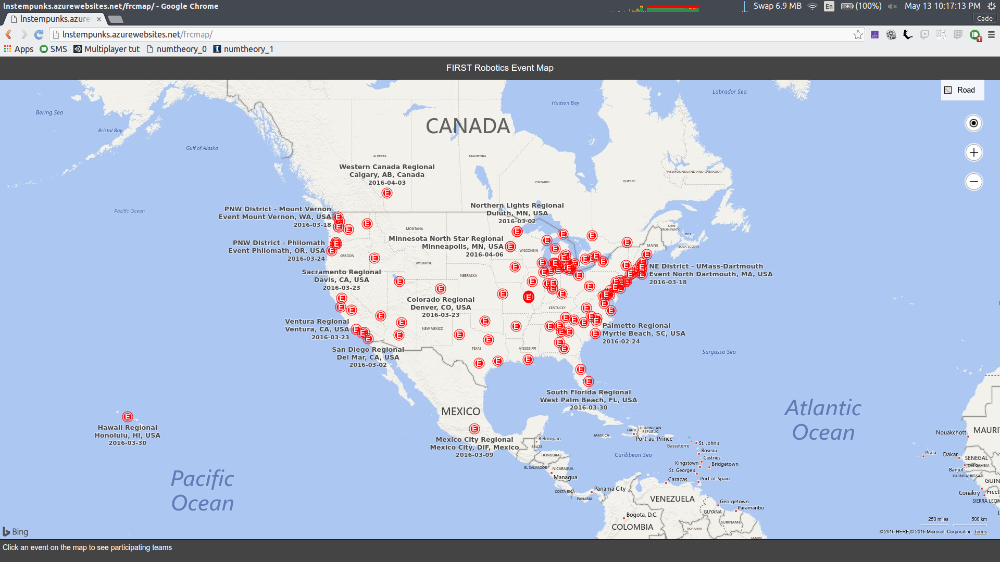
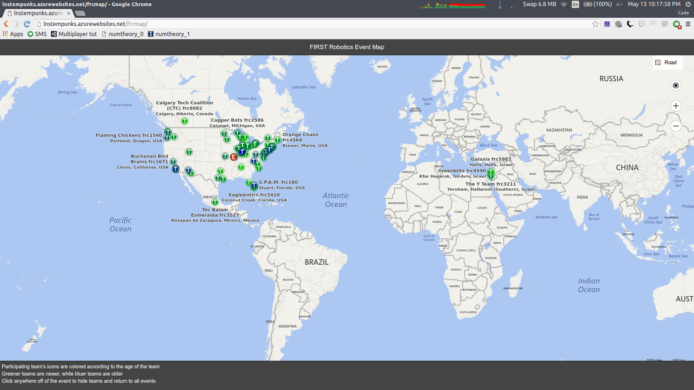
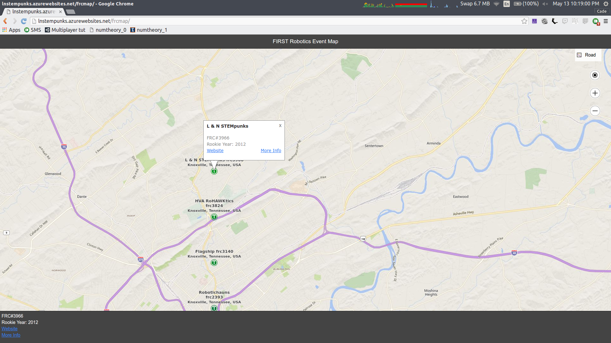
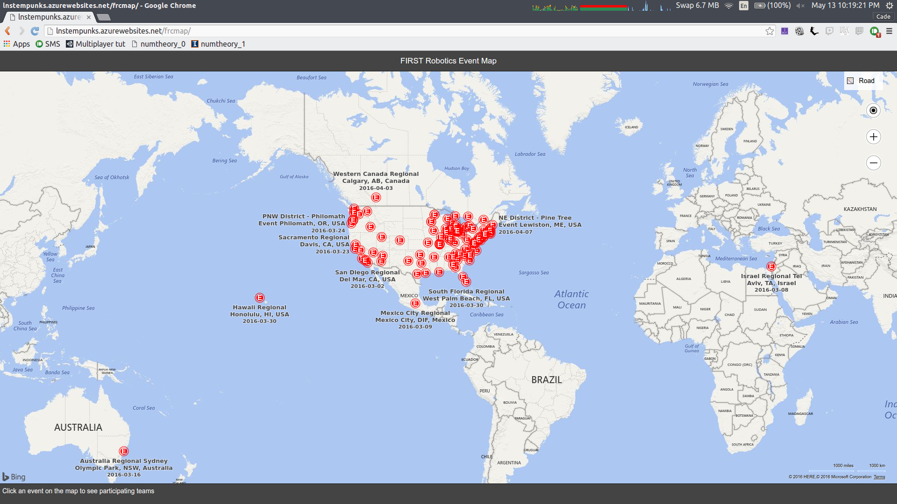

# FRCMap
A map of FRC events and teams

For the Open challenge, we decided to create an interactive map of FRC events. This allows a rich interactive user experience to explore the distribution of events and participating teams across the globe. The user can drag and zoom through a map, and pushpins appear where FRC events have taken place. When a user clicks an event, we show the teams that attended the selected event, and apply colored pushpins that signify the team's years of competition (newer teams are greener, while older teams are bluer in color). Users can then click a specific team pushpin (indicated with a T logo) for a popup infobox with some additional information on that team. On mobile devices, the information is shown in the footer rather than a popup box, which we've found to be cumbersome on mobile devices.

This is a JavaScript/HTML5 web app hosted in Azure. This app utilizes AngularJS in Ionic framework, Bing maps (Version 8), and our own custom written interface to the Blue Alliance API. We also integrated our submission for Challenge #3 by including a link to a team's more detailed information, which is more than we can show on a pushpin infobox. The app features dynamic content loading based on the user's platform (browser, mobile, etc.).

The navigation is simple: click the event you'd like to see, then click all the teams you'd like to see info about. This includes Name, FRC number, their website, and a link to another one of our apps, which shows even more details (like motto, previous performance, attended events, etc.). To hide the specific teams, and un-hide all other events, just click somewhere else on the map.

# Screenshots

